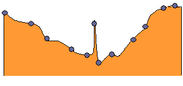

# Generation of anomalies in data <h1>

## The way anomalies are generated hugely varies from domain to domain, application to application. Let’s take a moment to review some of the fields where anomaly detection is extremely vital - <h2>
  
**Intrusion detection systems** -  *computer science field, unusual network traffic, abnormal user actions are common forms of intrusions. These intrusions are capable enough to breach many confidential aspects of an organization. Detection of these intrusions is a form of anomaly detection*

**Fraud detection in transactions** - *One of the most prominent use cases of anomaly detection. Nowadays, it is common to hear about events where one’s credit card number. This can, in turn, lead to abnormal behavior in the usage pattern of the credit cards. 

**Electronic sensor events** - *Electronic sensors enable us to capture data from various sources. Mobile devices are also powered with various sensors like light sensors, accelerometer, proximity sensors, ultrasonic sensors and so on. Sensor data analysis has a lot of interesting applications. But what happens when the sensors become ineffective? This shows up in the data they capture. When a sensor becomes dysfunctional, it fails to capture the data in the correct way and thereby produces anomalies.  Sometimes, there can be abnormal changes in the data sources as well. For example, one’s pulse rate may get abnormally high due to several conditions and this leads to anomalies. This point is also very crucial considering today’s industrial scenario. We are approaching and embracing Industry 4.0 in which IoT (Internet of Things) and AI (Artificial Intelligence) are integral parts. When there is IoT, there are sensors. In fact a wide network of sensors, catering to an arsenal of real-world problems. When these sensors start to behave inconsistently the signals they convey get also uncanny, thereby causing unprecedented troubleshooting. Hence, systematic anomaly detection is a must here.

# Anomalies can be of different types <h1>

**Global** - *Global anomalies are the most common type of anomalies and correspond to those data points which deviate largely from the rest of the data points. The figure used in the “Find the odd ones out: Anomalies in data” section actually depicts global anomalies.*

*A key challenge in detecting global anomalies is to figure out the exact amount of deviation which leads to a potential anomaly. In fact, this is an active field of research. Follow this excellent paper by Macha et al. for more on this. Global anomalies are quite often used in the transnational auditing systems to detect fraud transactions. In this case, specifically, global anomalies are those transactions which violate the general regulations.*

*You might be thinking that the idea of global anomalies (deviation from the normal) may not always hold practical with respect to numerous conditions, context and similar aspects.  Yes, you are thinking just right. Anomalies can be contextual too!*

**Contextual** - *Consider today’s temperature to be 32 degrees centigrade and we are in Bangalore, a city situated in India. Is the temperature normal today? This is a highly relative question and demands for more information to be concluded with an answer. Information about the season, location etc. are needed for us to jump to give any response to the question - “Is the temperature normal today?”

Now, in India, specifically in Bangalore, if it is Summer, the temperature mentioned above is fine. But if it is Winter, we need to investigate further.  Let’s take another example. We all are aware of the tremendous climate change i.e. causing the Global Warming. The latest results are with us also*

*Take note of the phrase “unusually warm”. It refers to 59-degrees Fahrenheit. But this may not be unusually warm for other countries. This unusual warmth is an anomaly here.

*These are called contextual anomalies where the deviation that leads to the anomaly depends on contextual information. These contexts are governed by contextual attributes and behavioral attributes. In this example, location is a contextual attribute and temperature is a behavioral attribute*

*The above figure depicts a time-series data over a particular period of time. The plot was further smoothed by kernel density estimation to present the boundary of the trend. The values have not fallen outside the normal global bounds, but there are indeed abnormal points (highlighted in orange) when compared to the seasonality.*

*While dealing with contextual anomalies, one major aspect is to examine the anomalies in various contexts. Contexts are almost always very domain specific. This is why in most of the applications that deal with contextual anomalies, domain experts are consulted to formalize these contexts.*

**Collective** - *In the following figure, the data points marked in green have collectively formed a region which substantially deviates from the rest of the data points.*

This an example of a collective anomaly. The main idea behind collective anomalies is that the data points included in forming the collection may not be anomalies when considered individually. Let’s take the example of a daily supply chain in a textile firm. Delayed shipments are very common in industries like this. But on a given day, if there are numerous shipment delays on orders then it might need further investigation. The delayed shipments do not contribute to this individually but a collective summary is taken into account when analyzing situations like this.

Collective anomalies are interesting because here you do not only to look at individual data points but also analyze their behavior in a collective fashion.

*So far, we have introduced ourselves to the basics of anomalies, its types and other aspects like how anomalies are generated in specific domains. Let’s now try to relate to anomalies from a machine learning specific context. Let’s find out answers to general questions like - why anomalies are important to pay attention to while developing a machine learning model and so on*

